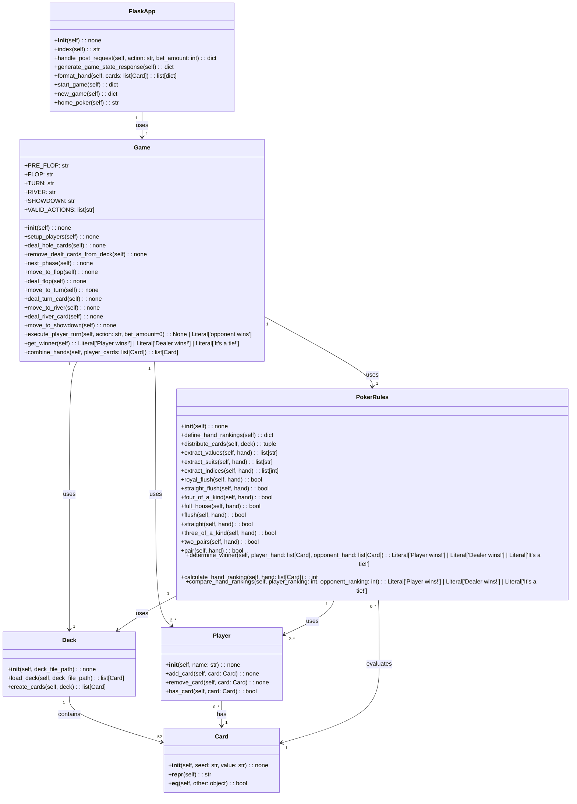

Note:

To access the online functionalities of this poker game, use Flask as a server within the texas_hold_em_poker.py file. 
This file not only manages web-based interactions but also initiates the game, serving as the central hub for the system's dynamic operations.